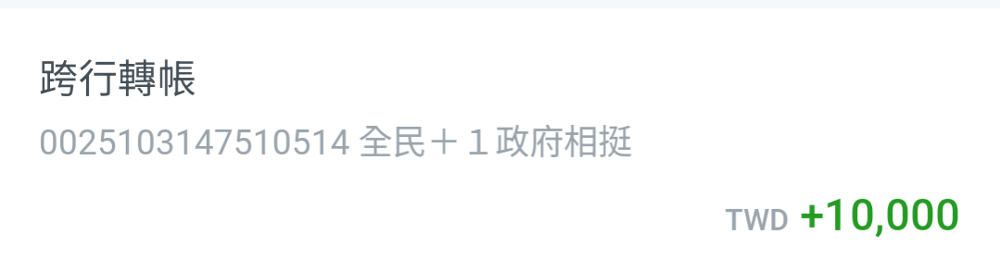

+++
title = '寒假回顧'
date = 2026-02-23T17:27:11+08:00
draft = false
+++
六個禮拜的寒假一下就過了，來看一下事情都做完了沒 
### 領普發一萬
領了，領到星展帳戶。BTW,星展備註是「全民+1 政府相挺」 

### 整理房間
整理一半，還沒整理完。
### 換電腦機殼
換好了，只是裡面感覺空空的，沒有RGB風扇、顯卡，又是 MATX 的主機板，看起來就很不搭。
### 開證券戶
拖到大年初四才開戶，還在審核中。除了[口袋證券](pocket.tw)以外，順便開 [XREX](xrex.io) 。不過開完才發現 XREX 預設不開放加密貨幣出金了，要額外審核。
### 規劃行程
新加坡行完美結束，只是這次回來又趕冒了（嚴格來說是最後一天就趕冒了，跟上次不一樣）。
### 追劇
統整一下寒假追的劇
#### 追完
- [職不值得](https://www.mewatch.sg/show/The-Grind-598547)
- [送餐英雄](https://www.mewatch.sg/show/Cash-On-Delivery-379929)
- [命運使者](https://www.mewatch.sg/show/Fixing-Fate-559461)
#### 沒追完
- [活出好命來](https://www.mewatch.sg/show/Perfectly-Imperfect-552690)
- [迷茫又無俱的我們](https://www.mewatch.sg/show/Last-but-not-Least-617205)